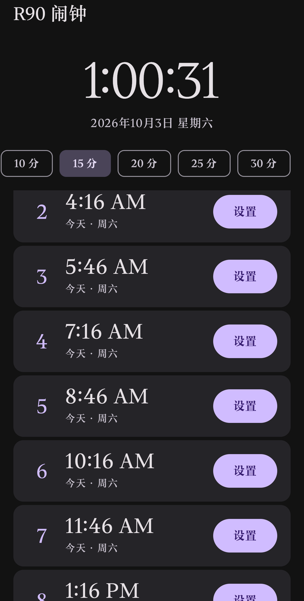
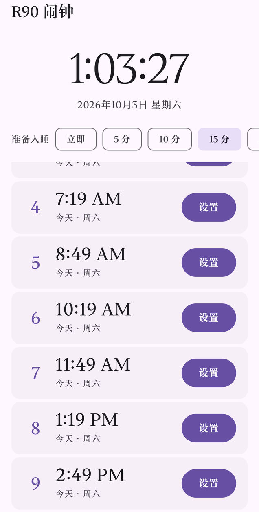
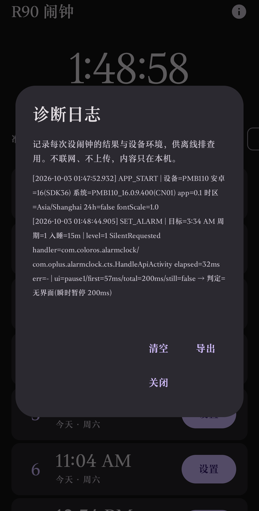

# R90 Alarm

**Open it and you immediately know: "if I fall asleep now, what time should I wake up to complete N sleep cycles of 90 minutes?" One tap hands that time to the system clock app.**

[中文](README.md) ｜ Offline · Zero runtime permissions · No database · No account · Kotlin + Jetpack Compose

<p align="center">
  
  
  
</p>

---

> **Note on documentation:** all files under `docs/` are written in Chinese only. This README covers everything needed to build and run the app.

## What it is

Sleep cycles run in roughly 90-minute rounds (the "R90" idea). This app takes *right now* as the starting point, computes nine candidate wake-up times, and lays them out on one screen — one "set system alarm" button per row.

It aligns with your **sleep rhythm**, not with fixed clock times. If you usually fall asleep at 2 AM, the computed times count forward from 2 AM in 90-minute steps; if you fall asleep at 3:30 AM instead, they shift immediately.

**Ringing is entirely outsourced to the system clock app.** There is not a single line of `AlarmManager` or `NotificationManager` in this project.

The reason: aggressive battery optimisation on Chinese Android ROMs freezes background processes, and "`AlarmManager` alarms don't fire" is a common complaint. The preinstalled system clock app, by contrast, is largely exempt from battery optimisation and auto-start restrictions. Rather than fight each vendor's background policy, this app hands the alarm to an app that already has the exemption.

## What it does not do

| | |
|---|---|
| No network | **It doesn't even request the `INTERNET` permission** — there is no network capability at the OS level, not merely a promise not to upload |
| No sign-in | No account system of any kind |
| No database | No Room, no SQLite, no business data in SharedPreferences |
| No runtime permissions | Install and use — **not a single permission dialog** |
| No background service | No `Service`, no foreground notification, no boot receiver |

Size: 6 Kotlin source files, 1310 lines.

## Install

### Use the prebuilt APK

1. Open the [Releases](https://github.com/qimu0113/r90-alarm/releases) page
2. Download `r90-alarm-v0.1.apk`
3. Open it on your phone and install (you'll need to allow "install unknown apps" once)

| Item | Value |
|---|---|
| Package name | `com.yanfei.r90alarm` |
| Version | 0.1 |
| minSdk / targetSdk | 26 / 35 (Android 8.0 and up) |
| Size | 1,146,076 bytes (~1.1 MB) |
| APK SHA-256 | See the corresponding [Release](https://github.com/qimu0113/r90-alarm/releases) notes (each build records the hash of the artifact it produced) |
| Permissions | Exactly one system permission is declared: `com.android.alarm.permission.SET_ALARM` (normal level, granted at install, **no dialog**). One further permission, `DYNAMIC_RECEIVER_NOT_EXPORTED_PERMISSION`, is added automatically by androidx — it is app-defined and grants no actual capability. **No `INTERNET`** |
| Signing | APK Signature Scheme **v2** (minSdk 26 is already above the API 24 that makes v1 necessary) |

Signing certificate SHA-256 fingerprint:

```
289f0d2c7fc0101941de962d3f0253a8eeb901fca1beb318cc499bd97c07f216
```

If you don't want to trust the binary, build it yourself from source and compare.

### Build from source

```bash
git clone https://github.com/qimu0113/r90-alarm.git
cd r90-alarm
./gradlew assembleDebug
adb install -r app/build/outputs/apk/debug/app-debug.apk
```

You need JDK 17–21 and Android SDK 35. **Android Studio is not required** — the command line is enough. See [Building](#building).

## How it works

```
Now
  → + time to fall asleep (default 15 min, adjustable)
  → + N × 90 min (N = 1..9)
  = wake-up time
  → handed to the system clock (AlarmClock.ACTION_SET_ALARM)
```

Rounding rule: seconds are **rounded up** (`04:32:59` → `04:33`), so the alarm fires at most 59 seconds late. After rounding, the app also works out whether the target lands today, tomorrow, or the day after, and labels the row accordingly.

## Three-level fallback

The system clock's "silent setup" switch (`EXTRA_SKIP_UI`) is officially defined as a **request** to skip the UI — vendors are free to ignore it. So there are three levels:

```
Level 1   SKIP_UI = true      Request a silent set, no UI
Level 2   SKIP_UI = false     Open the clock app prefilled, user taps Save
Level 3   No clock app at all Show a dialog: "no system clock found" + three remedies
```

`SystemAlarmLauncher.setAlarm()` walks L1 → L2 automatically and returns `SilentRequested`, `UiFallback`, or `NoHandler`. The app always tells you which level it reached — success gives feedback, failure gives a reason.

**Measured on the target device** (OnePlus Ace 6 Ultimate / ColorOS 16): `EXTRA_SKIP_UI = true` **is honoured** — the alarm is written with no UI. A control run with `SKIP_UI = false` confirmed this wasn't an artefact of the lock screen. Full evidence chain (including smali decompilation and raw commands) is in `docs/真机验证-ColorOS16-SKIPUI.md`.

> For vendors other than OPPO, `SKIP_UI` behaviour is **an educated guess with no on-device verification**. That's exactly why L2 exists.

## Diagnostic log

Open it from the ⓘ button in the top-right corner.

Why it exists: the system clock **returns nothing** (`startActivity` is one-way), so the app can never prove to itself whether the last tap actually popped a UI. The log records "what really happened on this device" so compatibility can be analysed offline, without keeping a computer attached.

| When | What |
|---|---|
| Every cold start | `APP_START` + device model / Android version / build number / app version / time zone / 24-hour setting / font scale |
| Every "set" tap | `SET_ALARM` + target time / cycle count / fall-asleep bucket / which level was used / clock handler component / call duration / exception class |

**The key indirect evidence: how long this app was paused.**

Whenever an Activity is launched, the caller gets `onPause` first. Therefore:

- Silent path → momentary pause (measured **200 ms** here), then straight back → judged "no UI"
- UI path → stays paused until the user taps Save → judged "UI was shown"

The threshold is 1200 ms. This is a **heuristic**, so the raw numbers (pause count, first-pause delay, total paused time, still-paused flag) are kept alongside it; offline analysis should trust the raw values.

A real record:

```
[2026-10-03 01:48:44.905] SET_ALARM | target=3:34 AM cycles=1 sleep=15m | level=1 SilentRequested
  handler=com.coloros.alarmclock/com.oplus.alarmclock.cts.HandleApiActivity elapsed=32ms err=-
  | ui=pause1/first=57ms/total=200ms/still=false -> verdict=no UI (200ms momentary pause)
```

**Privacy boundary:** the log is written only to the app's private `filesDir` (needs no permission). Exporting goes through the system share sheet or the clipboard — whether you send it, and to whom, is entirely your call. Capped at 500 lines; the oldest are dropped.

## Compatibility

| Aspect | Conclusion |
|---|---|
| OS version | **Android 8.0 (API 26) and up.** Every API used requires ≤ 26 (`EXTRA_SKIP_UI` needs API 11, `java.time` needs API 26) |
| Permissions | Only `SET_ALARM` (normal level, granted at install, **no dialog**) |
| Android 11+ package visibility | `<queries>` declared with `<intent>`, vendor-agnostic |
| Android 12+ `exported` | Explicitly declared |
| Android 15+ edge-to-edge | Relies on `Scaffold` default insets; verified intact on Android 16 |
| **Vendor `SKIP_UI` behaviour** | **The only variable.** Honoured → silent set; ignored → falls back to "prefill + user saves". Verified honoured on ColorOS 16 |

Full assessment (in Chinese): `docs/兼容性说明.md`.

## Building

| Item | Requirement |
|---|---|
| JDK | 17 – 21 (AGP 8.6.1 supported range) |
| Android SDK | API 35 (compileSdk / targetSdk), build-tools 35.0.0 |
| Gradle | 8.9 (wrapper included; nothing to install) |
| AGP / Kotlin | 8.6.1 / 2.0.21 |

First let Gradle find your JDK — pick either:

```bash
# Option 1: set JAVA_HOME
export JAVA_HOME=/path/to/jdk-21

# Option 2: a user-level config file (recommended; keeps the repo clean)
# ~/.gradle/gradle.properties
# org.gradle.java.home=/path/to/jdk-21
```

Point at your SDK in `local.properties` (not committed):

```properties
sdk.dir=/path/to/Android/Sdk
# Must use forward slashes. A backslash form like D\:\Android\Sdk gets eaten
# as an escape sequence by java.util.Properties and silently breaks.
```

Then:

```bash
# Unit tests (41, pure JVM, no device needed)
./gradlew testDebugUnitTest --rerun-tasks --no-build-cache
# Do NOT drop those two flags: without them Gradle may hand back the report
# from before your code change — a fake all-green. Report:
# app/build/reports/tests/testDebugUnitTest/
```

```bash
./gradlew assembleDebug     # -> app/build/outputs/apk/debug/app-debug.apk
./gradlew assembleRelease   # -> app-release.apk (or app-release-unsigned.apk without a key)
```

### Producing a signed build

Create `keystore.properties` in the project root (already gitignored):

```properties
storeFile=/path/to/your-release.jks
keyAlias=your-alias
storePassword=...
keyPassword=...
```

If the file is missing the build still succeeds — you just get an unsigned APK. Generate a key with `keytool`:

```bash
keytool -genkeypair -v -keystore your-release.jks -keyalg RSA -keysize 2048 \
  -validity 10000 -alias your-alias
```

> **Losing the keystore permanently costs you the ability to ship upgrades under the same package name** (signature mismatch — users would have to uninstall and reinstall). Back it up to at least two places right away.

### Network (mainland China)

`repo1.maven.org` times out after ~15 s here, so `settings.gradle.kts` prefers Aliyun mirrors with the official repos as fallback.

The Gradle distribution defaults to a Tencent mirror, pinned with a `distributionSha256Sum` for integrity (verified **identical** to the official published value):

```
d725d707bfabd4dfdc958c624003b3c80accc03f7037b5122c4b1d0ef15cecab
```

To switch back to the official source, a ready-made alternate config ships with the repo:

```bash
cp gradle/wrapper/gradle-wrapper-official.properties gradle/wrapper/gradle-wrapper.properties
```

## Known hard limits

| Limit | Detail |
|---|---|
| **`EXTRA_SKIP_UI` is not guaranteed to be honoured** | Officially it's only a *request*. It works on the tested device, but a different ROM or an OS update may change that — hence the mandatory L2 fallback |
| Minute precision only | The system alarm API takes `EXTRA_HOUR` + `EXTRA_MINUTES`; there's nowhere to put seconds |
| Can't confirm the silent set actually happened | `startActivity` is one-way. The app can only infer from how long it was paused |
| **Can't read or delete alarms in the system clock** | On ColorOS, `ClockProvider` demands the system-level `oppo.permission.OPPO_COMPONENT_SAFE`, which neither the app nor `adb shell` can obtain; there is also no `ACTION_DELETE_ALARM` |
| Rounding | Seconds round up (`04:32:59` → `04:33`), so the alarm fires up to 59 s late |

### Target device, measured (2026-10-03)

| Item | Result |
|---|---|
| Device / OS | PMB110 (OnePlus Ace 6 Ultimate) / ColorOS 16.0.9.400 / Android 16 (SDK 36) |
| Clock app | `com.coloros.alarmclock` (not AOSP DeskClock) |
| `ACTION_SET_ALARM` handler | Exactly one system-wide: `com.oplus.alarmclock.cts.HandleApiActivity` |
| **`EXTRA_SKIP_UI = true`** | ✅ **Honoured** — no UI, alarm written directly |
| `EXTRA_SKIP_UI = false` (control) | UI appeared as expected, proving the line above wasn't a lock-screen artefact |
| Clock handler theme | `Theme.Translucent` (**not** `NoDisplay`), so the "theme guarantees no UI" theory does not hold |

## Verification boundary

**Verified on real hardware**

| Item | Method | Result |
|---|---|---|
| Project compiles | `./gradlew assembleDebug` | ✅ `BUILD SUCCESSFUL` |
| **41 unit tests** (29 calculation + 12 log/verdict) | `--rerun-tasks --no-build-cache` to force a real run | ✅ `tests="41" failures="0" errors="0"` |
| Core arithmetic, real JVM | `_verify/CeilVerify.java` on JDK 21 | ✅ 16/16 assertions pass |
| Exhaustive boundary sweep | Java version, 432 start points × 9 cycles = 3888 results | ✅ 0 out-of-range, 0 wrong rounding direction, 0 `dayDiff` inconsistencies |
| `SKIP_UI` on device | `am start` + `dumpsys alarm` control experiments | ✅ Honoured: no UI, alarm correctly written |
| No network permission | `aapt2 dump permissions` on the APK | ✅ **Confirmed absent** |
| Installs on device | `adb install -r` | ✅ `Success` (device must be unlocked; it hangs on the lock screen) |
| UI renders | Screenshot + `uiautomator` node dump | ✅ All 9 rows present, large clock ticking every second |
| Rounding on device | Row-by-row text vs. formula | ✅ 9/9 rows match round-up |
| Large font, no clipping | `font_scale` 1.3 / 1.5 | ✅ No truncation or overlap at either setting |
| Dark / light mode | `cmd uimode night no` | ✅ Both palettes correct |
| **End to end: button → system alarm** | Tap + `logcat` + `dumpsys alarm` + clock list | ✅ Silent, 230 ms, alarm stored and visible in the clock app |
| Diagnostic log written | `run-as` read of `files/diagnostic.log` | ✅ Both record types written correctly |
| Log panel renders | `uiautomator dump` | ✅ Title / description / body / clear / export / close all present |
| Runtime permissions | `dumpsys package` + `dumpsys netstats` | ✅ 2 permissions only, no dialog, **zero network records** |
| Release build / R8 | `./gradlew assembleRelease` | ✅ R8 minify + resource shrinking + lint-vital all pass |
| APK size | debug vs release (each measured at build time) | 9,497,612 B → **1,146,076 B** (signed; R8 cuts ~88%) |
| Signature valid | `apksigner verify` | ✅ v2 scheme, `CN=r90-alarm` |
| Android API claims | Checked one by one against official docs | ✅ See `docs/方案.md` appendix A |
| Independent review | A separate reviewer rebuilt and recomputed from scratch | ✅ Found 4 P0 + 6 P1 issues, including one fabricated API fact, one wrong code location, and one **test-cache false positive** (the author had misjudged it) |

**Not verified — this machine couldn't do it**

- ❌ **The 40-case test plan was not executed item by item.** Covered: UI rendering, rounding, large fonts, dark/light, the end-to-end alarm path, permissions.
  Not covered: time-zone switching, leap year, Do-Not-Disturb/silent, alarm survival across reboot, battery-saver + lock screen, **the cross-day "tomorrow / day after" labels** (testing happened in the small hours, so all 9 rows landed on the same day), and the Level 3 fallback (which needs the system clock app to be disabled — an invasive change).
- ❌ **Per-second heartbeat power draw was never measured.** The heartbeat is stopped on `pause` in code, but no battery measurement was taken.
- ❌ **R8 runtime behaviour is only verified as "the build doesn't fail."** Whether any class was wrongly stripped still needs several real-device runs.
- ❌ **Verified on exactly one device (ColorOS 16).** Every other vendor's `SKIP_UI` behaviour is speculation.

> **"It compiles and the tests are green" does not mean "the app is correct."**
> This version runs on real hardware, the UI has been seen, the button has been tapped, and test residue was cleaned up.
> But everything listed above as uncovered **is unverified** — it must not be treated as "probably fine."

## Repository layout

```
r90-alarm/
├── app/src/main/
│   ├── AndroidManifest.xml              permissions + package-visibility queries
│   └── java/com/yanfei/r90alarm/
│       ├── R90Calculator.kt             arithmetic core (pure logic, unit-testable)
│       ├── SystemAlarmLauncher.kt       system alarm call + 3-level fallback
│       ├── DiagLog.kt                   log persistence + env snapshot + pause observer
│       ├── DiagFormat.kt                log formatting + "did a UI appear?" verdict
│       ├── MainActivity.kt              Compose UI
│       └── R90Theme.kt                  theme (including dark)
├── app/src/test/java/com/yanfei/r90alarm/
│   ├── R90CalculatorTest.kt             29 calculation tests
│   └── DiagFormatTest.kt                12 log/verdict tests
├── docs/                                Chinese-language documentation
├── _verify/CeilVerify.java              independent JVM cross-check (Java mirror, 16 assertions)
├── .gitignore / .gitattributes
└── LICENSE                              MIT
```

## Build pitfalls worth knowing

All of these only surface when you actually run a build — reading the code won't reveal them. You'll hit them again on a fresh machine:

| # | Pitfall | Symptom | Fix |
|---|---|---|---|
| 1 | `#` comments in `build.gradle.kts` | Kotlin DSL only accepts `//`; the build script fails with `Unresolved reference` | Use `//` |
| 2 | Missing Compose compiler plugin | Since Kotlin 2.0 it's a separate plugin: `Compose Compiler Gradle plugin is required` | Declare `org.jetbrains.kotlin.plugin.compose`, version locked to Kotlin |
| 3 | Backslashes in `local.properties` | `D\:\Android\Sdk` is parsed as `D:AndroidSdk`; the error misleadingly points at `compileDebugJavaWithJavac` | Use forward slashes |
| 4 | Non-ASCII project path | **A Chinese path doesn't affect `assembleDebug`, but it breaks `testDebugUnitTest` outright** (on Windows the test worker can't pass a non-ASCII classpath → `ClassNotFoundException`) | Keep the project in a pure-ASCII directory |
| 5 | False-positive test results | `testDebugUnitTest` reports `BUILD SUCCESSFUL`, but on the *pre-change* report | Add `--rerun-tasks --no-build-cache` and compare report timestamps against source mtimes |

Pitfall 4 was initially misjudged: the early conclusion was "Chinese paths are fine, no need to move" — true for `assembleDebug`, false for `testDebugUnitTest`. A cached false positive hid the truth until forced reruns exposed it.

## License

[MIT](LICENSE).

The only third-party dependencies are androidx / Jetpack Compose, all Apache-2.0 — no GPL contamination.

No analytics, no tracking, no ad SDKs.
